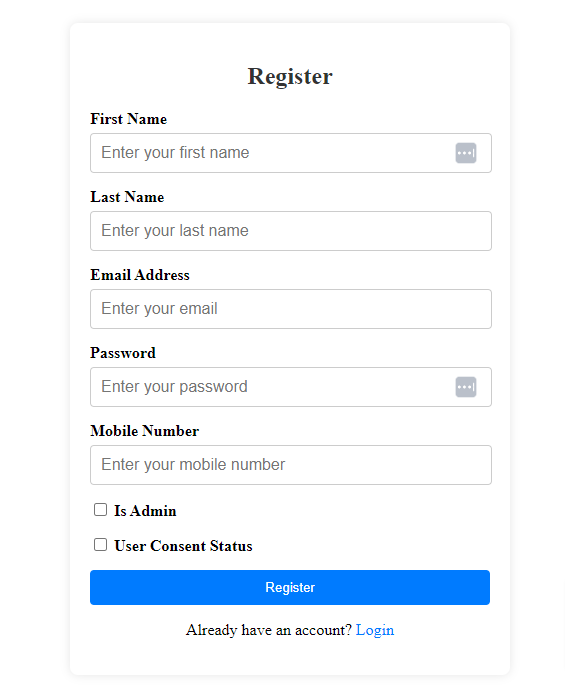
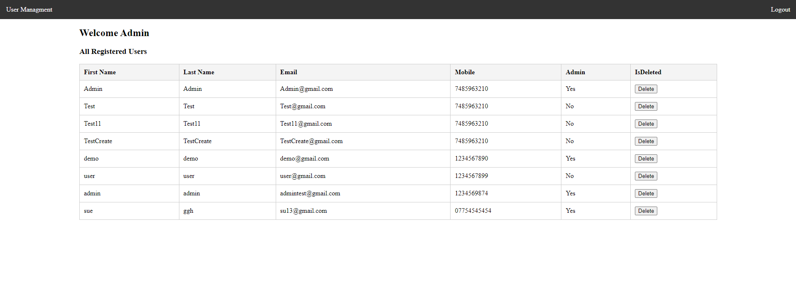

# User login/register application

  

This project is an Angular application that implements user registration, login, and role-based access control. It supports two types of users: Admin User and Standard User. The application uses NgRx for state management, Auth Guards for role-based access, and an HTTP Interceptor for token management.

  
  

## Get started

### Clone the repo

```shell

git clone https://github.com/dharmin-wa/Task1.git

cd Task1

cd user-GDPR-FE

```

### Install npm packages

Install the `npm` packages described in the `package.json` and verify that it works:

```shell

npm install

npm  start

```

The `npm start` command builds (compiles TypeScript and copies assets) the application into `dist/`, watches for changes to the source files

Shut it down manually with `Ctrl-C`.

#### npm scripts

These are the most useful commands defined in `package.json`:

* `npm start` - runs the TypeScript compiler, asset copier, and a server at the same time, all three in "watch mode".

* `npm run build` - runs the TypeScript compiler and asset copier once.

  
  

## Features

  

- **User Registration**: Allows new users to register with the application.

- **User Login**: Allows existing users to log in with their credentials.

- **Admin User Features**:

- Can view a list of all registered users.

- **Standard User Features**:

- Can only view their own user details.

- **Role-Based Access Control**:

- Access to different areas of the application based on user roles.

- **Token Interception**:

- Automatically includes authentication tokens in HTTP requests once a user is logged in.

  

## Technologies Used

  

- **Angular**: Frontend framework for building the application.

- **NgRx**: State management for handling global application state.

- **RxJS**: Reactive programming library used with Angular and NgRx.

- **Auth Guard**: Guards routes to enforce role-based access.

- **HTTP Interceptor**: Automatically adds authentication tokens to HTTP headers for API calls.

- **Reusable Services and Components**: Common functionality is extracted into reusable components and services.






### Database settings

Update the MongoDB connection settings in the appsettings.json file:

{

"MongoDB": {

"ConnectionURI": "your-mongodb-connection-uri",

"DatabaseName": "user_GDPR",

"CollectionName": "Users"

}

}

Run the application using Visual Studio or the terminal

`dotnet run`

The application will be accessible with swagger at https://localhost:{port}/swagger/index.html


.NET/C# web application

### Clone the repo

```shell

git clone https://github.com/dharmin-wa/Task1.git

cd Task1

cd user-GDPR-BE

```

## Features

- **MongoDB Integration**: Utilizes the MongoDB driver to perform CRUD operations (Create, Read, Update, Delete) on a Users collection.

- **Logging with log4net**: Integrates log4net for logging various operations, including informational logs for successful actions and error logs for exceptions.

- **Data Encryption**: Employs an IEncryptionRepository to encrypt sensitive user information (e.g., email, password, mobile number) before storing it in the database and decrypts it upon retrieval.

- **User Consent Verification**: Checks whether the user has given consent (using the IsUserConsent property) before creating a user.

- **Error Handling**: Implements try-catch blocks to manage exceptions, particularly for MongoDB-specific errors and general exceptions, ensuring that all errors are logged appropriately.

- **Indexing**: Creates a compound index on the IsDeleted and Id fields to optimize query performance when fetching users.

- **Asynchronous Programming**: Methods are asynchronous, utilizing async/await for non-blocking database calls, which enhances scalability.

- **User Authentication**: The AuthenticateUser method validates user credentials by encrypting the input email and password and comparing them with the stored values.


## Technologies Used

- **C#**: The programming language used for development.

- **ASP.NET Core**: Framework for building web applications.

- **MongoDB**: NoSQL database for storing user information.

- **log4net**: Logging library for tracking application events.

- **Dependency Injection**: Used for managing service dependencies.

- **BSON**: Data format used by MongoDB.